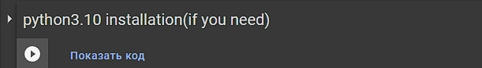

# getting start

1.Open [my notebook](https://colab.research.google.com/drive/1a87gjUb0KLf03ofE\_fCJ56qBL2B-om2c?usp=sharing) on google colab

2.Rtart this script to install python3.10(optional)

3.Run other scripts in order

## What is it for (if everything works fine without this add-on)?

My script helps to fix the error that occurs when trying to use the [SD](https://github.com/AUTOMATIC1111/stable-diffusion-webui) launched in the colab along with the [photoshop plugin](https://github.com/isekaidev/stable.art)
